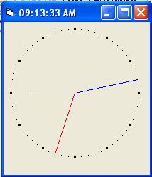

<div align="center">

## I Claim The Easiest Anolog Clock Method \(Gulp\)


</div>

### Description

Heres One For The Beginners. There Is An Extremely Easy Method To Clocks Using Sin\Cos, I've Seen a Few On PSC That Do The Job But Are A Litle Over Complex. At A Glance It Looks Long, Just Remove All The Comments And You'll See How Short The Code Actually Is. I hope This Helps
 
### More Info
 
You Just Need To Insert A Timer1


<span>             |<span>
---                |---
**Submitted On**   |
**By**             |[Steven Atkiss](https://github.com/Planet-Source-Code/PSCIndex/blob/master/ByAuthor/steven-atkiss.md)
**Level**          |Beginner
**User Rating**    |4.5 (18 globes from 4 users)
**Compatibility**  |VB 3\.0, VB 4\.0 \(16\-bit\), VB 4\.0 \(32\-bit\), VB 5\.0, VB 6\.0
**Category**       |[Math/ Dates](https://github.com/Planet-Source-Code/PSCIndex/blob/master/ByCategory/math-dates__1-37.md)
**World**          |[Visual Basic](https://github.com/Planet-Source-Code/PSCIndex/blob/master/ByWorld/visual-basic.md)
**Archive File**   |[](https://github.com/Planet-Source-Code/steven-atkiss-i-claim-the-easiest-anolog-clock-method-gulp__1-61883/archive/master.zip)

### API Declarations

None... It's Just maths


### Source Code

```
Private Sub Form_Load()
  Me.AutoRedraw = False
  Me.ScaleMode = 3
  Timer1.Interval = 500
End Sub
Private Sub Timer1_Timer()
  DrawHands Hour(Now), Minute(Now), Second(Now)
End Sub
Private Sub DrawHands(HourVal As Single, MinuteVal As Single, SecondVal As Single)
  Dim AMPM As String
  Dim Pi As Single
  Dim i As Single
  Dim X As Single
  Dim Y As Single
  Dim SecondAngle As Long
  Dim MinuteAngle As Long
  Dim HourAngle As Long
  Dim ClockDiamiter As Single
  Dim ClockPos As Single
  'Adjust Time For 12Hour Clock If Its 24Hour
  If Val(HourVal) > 12 Then
    HourVal = (HourVal - 12)
    AMPM = "PM"
  ElseIf HourVal = 0 Then
    HourVal = 12
    AMPM = "AM"
  Else
    AMPM = "AM"
  End If
  ClockDiamiter = 90
  ClockPos = ClockDiamiter + 10
  'Getting The Sin\Cos Of Your Clock
  '===========================
  'The Main Works, Or "Cogs" Are All To do With This Bit,
  'You Can Leave Th Pi At The Start Of Your Program And
  'Never Call It Again. As You Can See, The Circles Points
  'Are Drawn In Memory To The Diamiter And Step You Set.
  'Then When Your Drawing Your Points You Specify Where You
  'Want The Center Point Of The Clock To Be Drawn. Easy Eh!
  'Your Step Is Worked Out As Follows 360 \ How Many Points,
  'In This Case Theres 60Sec And 12Hrs In A Full Circle, So
  'Minutes And Seconds  = 360 \ 60 = Step Every 6 Degs
  'Hourse         = 360 \ 12 = Step Every 30 Degs
  'Convert Degrees To Radians
  Pi = 3.14159265 / 180
  Cls
  'Draw The Clock Seconds Points
  For i = 0 To 360 Step 6
    X = ClockDiamiter * Cos(i * Pi)
    Y = ClockDiamiter * Sin(i * Pi)
    Me.PSet (ClockPos + X, ClockPos + Y)
  Next i
  '============================
  'Draw The Clocks Hours Points
  For i = 0 To 360 Step 30
    X = ClockDiamiter * Cos(i * Pi)
    Y = ClockDiamiter * Sin(i * Pi)
    Line (ClockPos + X - 1, ClockPos + Y - 1)-(ClockPos + X + 1, ClockPos + Y + 1), , BF
  Next i
  'Determine Hand Angles
  '===========================
  '(-15 and -3)This Part Only Shifts The Position Of 12Oclock
  'When Using Sin And CosIn This Way, 0 Degrees Isn't At
  'The Top Of The Circle, It's At The "3 Oclock Position.
  'All We Have To Do Is Set The Display Back 1\4 To Get
  '12 Oclock Where 12 Oclock Should Be.
  SecondAngle = (360 / 60) * (SecondVal - 15)
  MinuteAngle = (360 / 60) * (MinuteVal - 15)
  HourAngle = (360 / 12) * (HourVal - 3)
  '===========================
  'Draw The Hour Hand
  X = (ClockDiamiter / 1.4) * Cos(HourAngle * Pi)
  Y = (ClockDiamiter / 1.4) * Sin(HourAngle * Pi)
  Line (ClockPos, ClockPos)-(ClockPos + X, ClockPos + Y), vbBlack
  'Draw The Minute Hands
  X = ClockDiamiter * Cos(MinuteAngle * Pi)
  Y = ClockDiamiter * Sin(MinuteAngle * Pi)
  Line (ClockPos, ClockPos)-(ClockPos + X, ClockPos + Y), vbBlue
  'Draw The Seconds Hand
  X = ClockDiamiter * Cos(SecondAngle * Pi)
  Y = ClockDiamiter * Sin(SecondAngle * Pi)
  Line (ClockPos, ClockPos)-(ClockPos + X, ClockPos + Y), vbRed
  'Digital Time Display
  Me.Caption = HourVal & ":" & MinuteVal & ":" & SecondVal & " " & AMPM
End Sub
```

